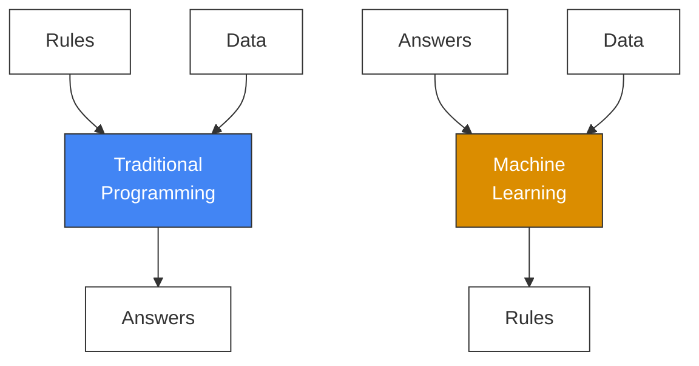

Before diving deeper into the world of generative AI and software development, it helps to step back and look at how things have traditionally worked—and how they're changing.

Traditional programming can be summarized in a simple flow like this:  

You start with **rules**—the logic you write in code. These rules act on **data**, and as a result, you get **answers**. Whether you're building a website, writing a game engine, or automating a process, most of what we've done as developers follows this structure. It's how we've all been trained to think about solving problems with code.

Here's what that looks like:

Now, here's where things start to shift.

With **machine learning**, we flip the process. Instead of explicitly writing out the rules, we give the computer **answers** and **data**—and it figures out the rules for us.

That's the heart of the machine learning revolution: rather than telling the computer exactly how to do something, we let it **learn** how, based on patterns in the data we provide. This change in mindset is what powers everything from recommendation engines to code generators.

It's a new methodology—and one that's reshaping how we approach building software entirely.
